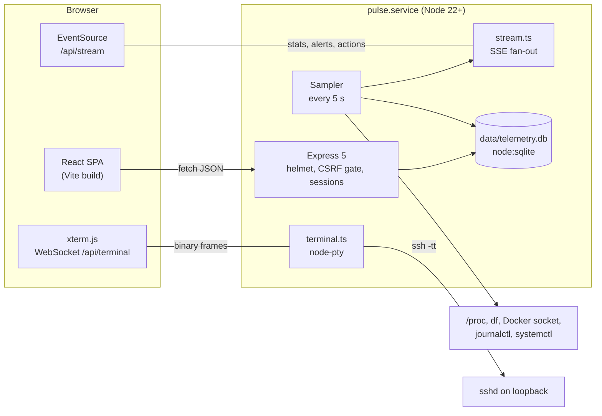

# Architecture

Pulse is one Node process that serves a React single-page app, a JSON API, a
server-sent event stream and a WebSocket terminal for the machine it runs on.
It has one user, runs as one systemd service on port 80, and keeps its state in
a SQLite file next to the code.



## Layout

| Path | What lives there |
| --- | --- |
| `src/server/index.ts` | Express app: security headers, auth and CSRF gates, every route, the sampler, startup and shutdown. |
| `src/server/collect/` | One collector per metric (CPU, memory, disk, filesystems, processes, Docker). Read-only. |
| `src/server/probe.ts` | HTTP probes of the configured services (latency, online). |
| `src/server/history.ts`, `store.ts` | In-memory ring for recent samples, SQLite for durable history, alert events and the action log. |
| `src/server/alerts.ts`, `notify.ts` | Threshold rules over the sample stream; optional Telegram delivery. |
| `src/server/actions.ts` | start, stop and restart for systemd units and containers: allowlist plus two-phase confirmation. |
| `src/server/logs.ts` | Bounded `journalctl` reads with validated unit names. |
| `src/server/reachability.ts`, `spend.ts` | Outside-in reachability check and LLM spend, both on demand. |
| `src/server/session.ts`, `csrf.ts` | Login, server-side sessions, origin checks, CSRF tokens. |
| `src/server/stream.ts` | Server-sent events to every open tab. |
| `src/server/terminal.ts` | WebSocket to pty bridge, remote SSH and Telnet targets, flow control. |
| `src/shared/contract.ts` | Types and constants shared by server and client: the API contract. |
| `src/hooks/` | Data hooks: `useStats`, `useHistory`, `useAlerts`, `usePolled`, `useAuth`. |
| `src/lib/stream.ts`, `csrf.ts` | The tab's one EventSource, and the CSRF token holder with `postJson`. |
| `src/components/` | Views and panels. `components/terminal/` is the terminal, loaded as its own chunk. |
| `src/styles.css`, `motion.css`, `terminal.css` | Plain CSS on design tokens; no CSS framework. |
| `deploy/` | Unit template, hardening drop-in, health-ping cron script. |

## Data flow

**Sampling.** A fixed 5-second timer in `index.ts` takes one snapshot: probes
every service and runs the collectors (a 2-second cache lets concurrent
callers share one round). Each tick records history, refreshes the action
allowlist, evaluates alert rules and publishes to the event stream. Sampling
does not depend on anyone watching, so the timeline means the same thing
whether zero or ten tabs are open.

**Push, not poll.** Each tab opens one `EventSource` on `/api/stream`
(`src/lib/stream.ts`). The server sends `stats` every tick, `alerts` when the
alert snapshot changes, `actions` after an action runs, and `bye` when the
session ends. A new connection gets the latest value of each event at once.
Hooks subscribe to the events they need, and history charts refetch on the
sample tick instead of on a timer.

The REST endpoints stay. Every hook falls back to polling them while the
stream is down (a proxy that buffers event streams, a server restart), so the
page keeps working. Reachability and spend are still fetched on their own
slow schedule: they cost an outbound request or a database scan, so the server
computes them only when a tab asks.

**History.** Recent samples sit in memory for the default view. Longer ranges
are read from SQLite as minute buckets. Responses are cached for 2 or 15
seconds and floats are rounded before serialising, because a 24-hour payload
is otherwise most of a megabyte.

**Terminal.** See `src/server/terminal.ts` for the full notes. In short:
xterm.js in the browser, node-pty on the server, and by default the pty runs
`ssh` to the loopback sshd so the shell lives outside the service sandbox.
Output and input travel as binary WebSocket frames; JSON is used only for
control. The browser asks the server to pause the pty when xterm falls behind.
Shells outlive the socket for 15 minutes and reattach by id. A window can
instead target a remote host over SSH or Telnet (routers, switches). The split
view keeps every terminal a flat DOM sibling and positions it from a layout
tree (`split.ts`), so re-arranging never remounts a shell.

## Key decisions

- **Express plus a Vite SPA, not Next.js.** Pulse is private, single-user and
  behind a login, so server rendering and SEO buy nothing. The terminal needs a
  long-lived WebSocket and node-pty in the same process, which Next.js only
  allows through a custom server; its inline runtime scripts would also need a
  nonce-based CSP. Revisit if the app grows public pages or several users.
- **SSE over WebSocket for telemetry.** The flow is one-way, EventSource
  reconnects by itself, it works through HTTP proxies as a normal GET, and it
  carries cookies with no extra handshake. WebSocket is kept for the terminal,
  which is two-way and binary.
- **SQLite through `node:sqlite`.** No native addon, no separate database
  process, one file to back up. Without Node 22 the app runs on in-memory
  history and says so in the UI.
- **No CSS framework.** Tokens in `styles.css` drive both themes. The design
  system is published separately as a Claude Design System artifact.
- **One process, no queue.** Everything the server does is bounded per tick or
  per request; nothing needs a worker.

## Running and deploying

```sh
npm run typecheck
npm run build                 # tsc for the server, vite for the client
sudo systemctl restart pulse  # the unit runs node dist/server/index.js
```

Configuration is environment variables (`.env`, loaded by a systemd drop-in);
see `.env.example` and the README. Security design and the audit log are in
[SECURITY.md](SECURITY.md).
